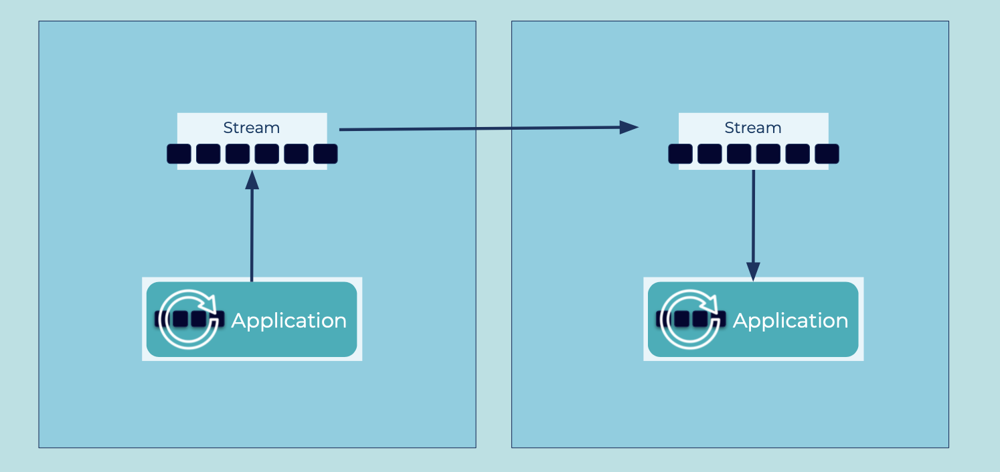

# Geo Replication
Many architectures have streams of events deployed across multiple datacenters spanning boundaries of event streaming platforms, datacenters, or geo-regions.
In these situations, it may be useful for client applications in one datacenter to have access to events produced in another datacenter.
All clients shouldn't be forced to read from the source datacenter, which can incur high latency and data egress costs.
Instead, with a move-once-read-many approach, the data can be mirrored to the destination datacenter and then the client there can "observe" the data.

## Problem
How can multiple event streaming platforms be connected so that events available in one site are also available on the others?

## Solution

Create a connection between the two [Event Streaming Platforms](../event-stream/event-streaming-platform.md) , enabling the destination platform to read from the source one.
Ideally this is done in realtime such that as new events are published in the source datacenter, they can be immediately copied, byte for byte, to the destination datacenter.
This allows the client applications in the destination to leverage the same set of data.

## Implementation
Practically, replication is not enabled on two complete datacenters, as there are always exceptions, organizational limitations, technical constraints, or other reasons why you wouldn't want to copy absolutely everything.
Instead, you can do this on a per topic basis, where you can map a source topic to a destination topic.

With Apache Kafka, you can do this in one of several ways.

Option 1: [Cluster Linking](https://docs.confluent.io/cloud/current/multi-cloud/cluster-linking.html)

Cluster Linking enables easy data sharing between datacenters, mirroring topics across clusters.
Because Cluster Linking uses native replication protocols, client applications can easily failover in the case of a disaster recovery scenario.

```
ccloud kafka link create east-west ...
ccloud kafka topic create <destination topic> --link east-west --mirror-topic <source topic> ...
```

Option 2: [MirrorMaker](https://kafka.apache.org/documentation/#georeplication)

Operators can set up such inter-cluster data flows with Kafka's MirrorMaker (version 2), a tool to replicate data between different Kafka environments.
Unlike Cluster Linking, it's a separate service built upon Kafka Connect, with built-in producers and consumers.

## Considerations
Note that this type of replication between clusters is asynchronous, which means an event that is recorded in the source cluster may be available before that event is recorded in the destination cluster.
There is also synchronous replication across clusters (e.g. [Multi Region Clusters](https://docs.confluent.io/platform/current/multi-dc-deployments/index.html)) but this is often limited to when the datacenters are in the same operational domain.

## References
* This pattern is derived from [Messaging Bridge](https://www.enterpriseintegrationpatterns.com/patterns/messaging/MessagingBridge.html) in Enterprise Integration Patterns by Gregor Hohpe and Bobby Woolf
